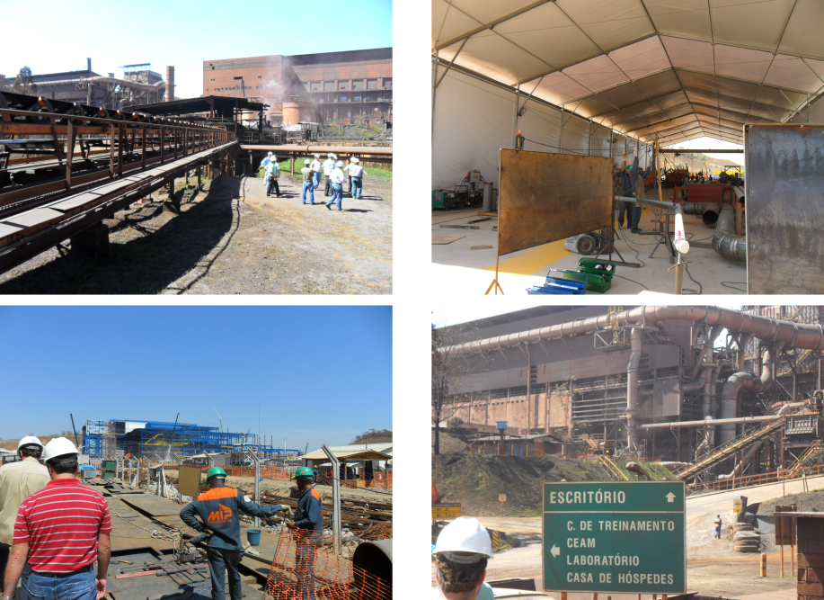
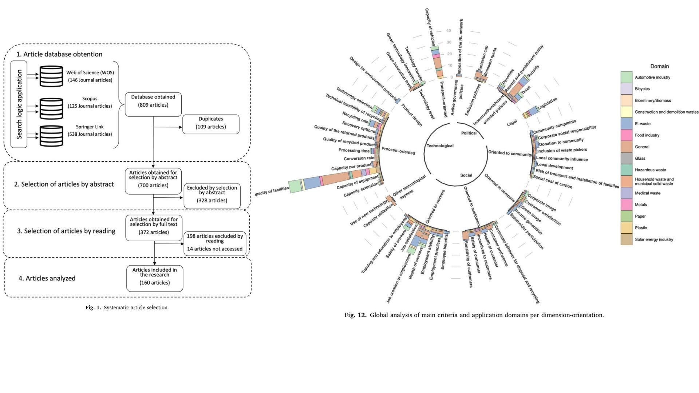
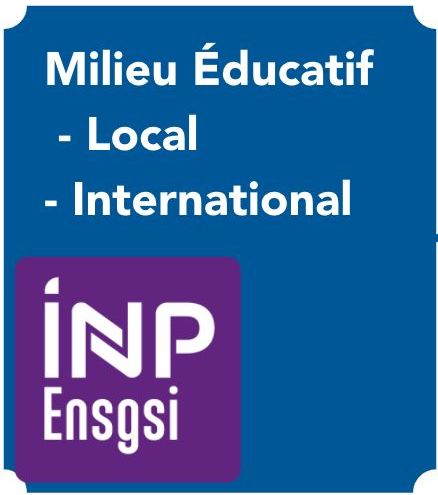

```{r setup, include=FALSE}
# Load packages -----
library(tidyverse)
library(xaringanExtra)
library(xaringanthemer)
library(fontawesome)
library(fontawesome)
library(here)
library(vembedr)

source(here("Presentation","xaringan-themer.R"))

options(htmltools.dir.version = FALSE)
knitr::opts_chunk$set(
  fig.width=9, fig.height=3.5, fig.retina=3,
  out.width = "100%",
  cache = TRUE,
  echo = FALSE,
  message = FALSE, 
  warning = FALSE,
  hiline = TRUE,
  fig.align='center'
)

# Link for the Figures
URL = c('https://raw.githubusercontent.com/fabbiocrux/Figures/main/')

```


class: title-slide, center, bottom


.pull-left[
```{r, echo=FALSE, out.width = '60%', fig.align='center'}
knitr::include_graphics(paste0(URL, 'Logos/ENSGSI/2022-ENSGSI.jpeg'))
```
]
.pull-right[
```{r, echo=FALSE, out.width = '70%', fig.align='center'}
knitr::include_graphics(paste0(URL, 'Logos/ERPI/ERPI.svg'))
```
]


****
## *Conception de produit open source soutenable: les atouts de la collecte jusqu'au recyclage en circuit court*

###  `r rmarkdown::metadata$title`

### `r fa("comment", fill = "steelblue")` `r rmarkdown::metadata$author`

`r fa("user-friends", fill = "steelblue")` `r rmarkdown::metadata$subtitle` | `r fa("map-marker-alt", fill = "steelblue")` `r paste0("Nancy ",  format(Sys.time(), '%d %B, %Y'))`


???

Bonjour à tous.
- Tout d’abord je vous remercie de m’accueillir aujourd’hui. 
- Je m'appelle Fabio Cruz. 
J’ai le plaisir de vous présenter de ma candidature pour le poste XXX à pourvoir au sein de l’INSPE 


---
class: middle

# Sommaire 

.grey_Inedit[
1. .large.bg-yellow[**Mon profil et parcours**]
1. Proposition D'intégration au ENSGSI et à l'ERPI 
1. COnclusion
]   


???

---


.pull-left-1[
```{r, echo=FALSE, out.width = '40%', fig.align='center', out.extra='class="rounded"'}
knitr::include_graphics(paste0(URL, 'Fabio/Fabio-300x300.jpg'))
```

34 ans - .large[`r emo::ji("colombia")`| `r emo::ji("france")`|]  <br>
Ingénieur Mécanique et <br>
Master II - Design Global.<br>
PhD. en Génie des Systèmes Industriels <br>
CNU : **60** – **62**   <br>
]


--

.pull-right-2[ 

- **2005 - 2012**:  Universidad Nacional de Colombie
   - **2010**: International trainee at .large[`r emo::ji("brazil")`]
   
```{r, echo=FALSE, out.width = '90%', fig.align='center'}

```
]

---

.pull-left-1[
```{r, echo=FALSE, out.width = '40%', fig.align='center', out.extra='class="rounded"'}
knitr::include_graphics(paste0(URL, 'Fabio/Fabio-300x300.jpg'))
```

34 ans - .large[`r emo::ji("colombia")`| `r emo::ji("france")`|]  <br>
Ingénieur Mécanique et <br>
Master II - Design Global.<br>
PhD. en Génie des Systèmes Industriels <br>
CNU : **60** – **62**   <br>

]


.pull-right-2[
- **2005 - 2012**:  Universidad Nacional de Colombie
   - **2010**: International trainee at .large[`r emo::ji("brazil")`]
***   

.large[`r emo::ji("france")`] **2012 - 2013**: Master M2: Management de l'Innovation  <br>
- **2013 - 2016**: Thèse de Doctorat France <br>
- **2017 - 2021**: Post-doc ERPI / Lorraine Fab Living Lab (LF2L) <br>
- **2021**: Post-doc InSyTE (Anciennement CREIDD) à l'UTT <br>
- **2021 - ...**: Chercheur ERPI / LF2L <br>
]

---


 .pull-left-2[
```{r, echo=FALSE, out.width = '100%', fig.align='center'}
knitr::include_graphics(paste0(URL, 'LF2L/Fablab/Fablab-00.png'))
```
]
.pull-right-1[
```{r,  out.width = '100%', fig.align='center'}
knitr::include_graphics(paste0(URL, 'Foldarap/Emmanuel-00.jpeg'))
```
]


---
class: top, left
background-image: url("images/SDRAM-00.jpg")
background-position: 50% 90%
background-size: 85%

## Recyclage distribué pour la Fabrication additive

--

background-image: url("images/SDRAM-01.jpg")

---

class: bottom, left
background-image: url("images/1-Machine.jpg")
background-position: 50% 20px
background-size: 85%

### Validation technique de machine open source


---
class: top, left
background-image: url("images/SDRAM-01.jpg")
background-position: 50% 90%
background-size: 85%

## Recyclage distribué pour la Fabrication additive

--

background-image: url("images/SDRAM-02.jpg")

---

class: bottom left
background-image: url("images/2-Recycling.jpg")
background-position: 50% 10px
background-size: 88%

### Faisabilité technique de recyclage pour la FA open source. 

---

class: top, left
background-image: url("images/SDRAM-02.jpg")
background-position: 50% 90%
background-size: 85%

## Recyclage distribué pour la Fabrication additive

--

background-image: url("images/SDRAM-03.jpg")

---

class: bottom, left
background-image: url("images/3-Logistical.jpg")
background-position: 50% 10px
background-size: 85%

###  Validation de la chaîne d'approvisionnment

---

class: top, left
background-image: url("images/SDRAM-03.jpg")
background-position: 50% 90%
background-size: 85%

## Recyclage distribué pour la Fabrication additive

--
background-image: url("images/SDRAM-04.jpg")

---

class: bottom, left


###  Validation de la chaîne d'approvisionnment

```{r,  out.width = '100%', fig.align='center'}

```


---

class: middle

# Du laboratoire vers la société

.pull-right.bg-yellow[... Mon **parcours enseignement**]

---
class:  left
# Mon Parcours Ensegnement

.pull-left[
```{r,  out.width = '50%', fig.align='center'}

```
]

---
class: top, left
background-image: url("images/Cursos-01.jpg")
background-position: 50% 50%
background-size: 95%

---
class: top, left
background-image: url("images/Cursos-02.jpg")
background-position: 50% 50%
background-size: 95%

---
class: top, left
background-image: url("images/Cursos-03.jpg")
background-position: 50% 50%
background-size: 95%

---

class: bottom, left
background-image: url("/Presentation/images/Green-Fablab.jpg")
background-position: top center
background-size: 50%


# Mon Projet pour ce Poste

---

## Attendus du Poste

.pull-left[
**Enseignement**

- De développer des contenus pédagogiques favorisant l’expérimentation. 
- Force de proposition pour faire évoluer les enseignements. 
- Projet de développement de l’école
- Déploiement de nouveaux types d’accompagnement offerts aux élèves ingénieurs 
]
.pull-right[
**Recherche:**

- Eco-conception des produits
- L'émergence des nouvelles filières (écosystèmes industriels) à partir des produits issus d’une l'innovation.
- Projets de recherche multi-partenariat
]

---

## Attendus du Poste: Enseignement

.pull-left[

Force de proposition:

- ... contenus pédagogiques .bg-green[favorisant l’expérimentation]. 

- Projet de développement de l’école

- Nouveaux types accompagnement offerts aux élèves ingénieurs 

]

--

.pull-right-1[
```{r, echo=FALSE, out.width = '100%', fig.align='center'}
knitr::include_graphics(paste0(URL, 'Foldarap/Emmanuel-00.jpeg'))
```
- Open Hardware
]

---

## Attendus du Poste: Enseignement

.pull-left[

Force de proposition:

- ... contenus pédagogiques favorisant l’expérimentation. 

- .bg-green[Projet de développement de l’école]

- Nouveaux types accompagnement offerts aux élèves ingénieurs 

]

.pull-right-1[
```{r, echo=FALSE, out.width = '100%', fig.align='center'}
knitr::include_graphics(paste0(URL, 'Foldarap/Emmanuel-00.jpeg'))
```
- Open Hardware
]

---

## Attendus du Poste: Enseignement

.pull-left-1[

Force de proposition:

- ... contenus pédagogiques favorisant l’expérimentation. 

- Projet de développement de l’école

- .bg-green[Nouveaux types accompagnement offerts aux élèves ingénieurs]

]

.pull-right-2[
```{r, echo=FALSE, out.width = '100%', fig.align='center'}
knitr::include_graphics(paste0(URL, 'Foldarap/Emmanuel-00.jpeg'))
```
- Open Hardware
]


---


## Attendus du Poste: Recherche

.pull-left-2[

```{r, echo=FALSE, out.width = '90%', fig.align='center'}
knitr::include_graphics(paste0(URL, 'Foldarap/Emmanuel-00.jpeg'))
```

- Open Hardware

]

.pull-right-1[

Force de proposition:


- Eco-conception. 

- Nouvelles filières

- 
]


---

class: bottom, left

# Thanks

---
class: bottom, left
background-image: url(`r paste0(URL,'Metodologies/Master-recherche/Master-01.png')`)
background-position: center
background-size: 90%

# Benchmarking research
